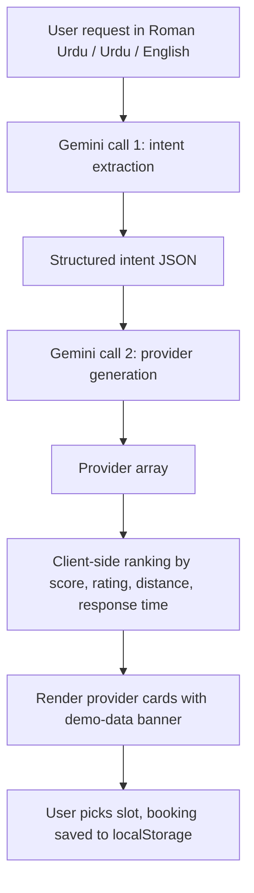

# Khidmat

A bilingual (English / Urdu) prototype web app for finding local service providers across Pakistan — plumbers, electricians, AC technicians, tutors, beauticians, carpenters, painters, cleaners, and mechanics.

**Live demo:** https://fuwxt.github.io/Khidmat/

[](LICENSE)

---

## Status

This is an **early prototype**. Provider names, phone numbers, ratings, and distances shown in search results are generated by Google Gemini for demonstration purposes — they are not real, and the WhatsApp / Call / Map buttons should not be used. There is no backend, no real authentication, and no server-side booking persistence. See [Roadmap](#roadmap) for what is needed before this can be used for real.

---

## Overview

Khidmat is a single-page web app that lets a user describe a problem in Roman Urdu, Urdu, or English (for example, *"Mujhe kal subah AC technician chahiye, gas bhi fill karni hai"*) and returns a ranked list of service providers in their chosen Pakistani city.

Two Gemini calls are involved per search:

1. The first extracts a structured intent from the user's free-text request (service category, urgency, time preference, location, key requirements).
2. The second generates a JSON array of plausible providers for that intent, with names, phone numbers, ratings, distances, and pricing.

The client sorts the result, applies optional filters (top / nearby / fast), and renders provider cards. Bookings are saved to `localStorage` with a `KHD-XXXXXX` reference code.

---

## Features

- Bilingual UI: English and Urdu, including RTL layout and the Noto Nastaliq Urdu typeface in Urdu mode.
- Roman Urdu / Urdu / English natural-language input, parsed by Gemini.
- Searchable dropdown of 50+ Pakistani cities across all provinces and territories.
- Price estimator with min / average / max / emergency rates per service category, in PKR.
- Light and dark themes, persisted to `localStorage`.
- Phone-style mobile-first layout, capped at 480 px.
- Installable PWA via a static `manifest.webmanifest` with 192 × 192 and 512 × 512 icons.
- Booking flow with slot picker, special instructions, confirmation screen, and persistent bookings list.
- Mock authentication flow (login, signup, OTP) — UI only.

---

## Tech stack

| Area              | Choice                                                       |
| ----------------- | ------------------------------------------------------------ |
| Markup, styles, JS | Plain HTML, CSS, and JavaScript. No build step.             |
| AI                | Google Gemini 2.0 Flash, called directly from the browser.  |
| Persistence       | `localStorage` for theme, language, city, bookings, and the user-supplied API key. |
| Typography        | Plus Jakarta Sans, Playfair Display, Noto Nastaliq Urdu (Google Fonts). |
| Hosting           | GitHub Pages.                                                |
| PWA               | Static manifest + theme color. No service worker yet.        |

---

## Project structure

```
Khidmat/
├── index.html              Markup for all 11 screens.
├── styles.css              Design tokens, components, and per-screen styles.
├── app.js                  State, screen routing, Gemini calls, and rendering.
├── manifest.webmanifest    PWA manifest.
├── .github/workflows/
│   └── deploy-pages.yml    Auto-deploys to GitHub Pages on push to main.
├── LICENSE
├── .gitignore
└── README.md
```

---

## Running locally

The project is plain static files with no build step or dependencies.

```bash
git clone https://github.com/fuwxt/Khidmat.git
cd Khidmat
python3 -m http.server 8080
# then open http://localhost:8080
```

Any other static server works equally well — `npx serve .`, `caddy file-server`, `php -S localhost:8080`. Opening `index.html` directly via `file://` mostly works, but the manifest fetch (and any future service worker) need an HTTP origin.

---

## Configuration

On first launch the app asks for a Google Gemini API key. A free key can be created at https://aistudio.google.com.

The key is stored only in the browser's `localStorage` and is sent directly from the browser to `generativelanguage.googleapis.com` over HTTPS. It is never committed to the repository.

This is acceptable for a personal prototype, but **not** for a production deployment — the key is visible in network logs and to anyone with access to the device. Putting Gemini behind a backend proxy is the first item on the production roadmap.

---

## How it works



The intent JSON has the shape:

```json
{
  "service_type": "AC technician",
  "service_cat": "ac_technician",
  "location": "Lahore",
  "urgency": "med",
  "time_preference": "tomorrow morning",
  "key_requirements": ["gas filling"]
}
```

Each provider returned by the second Gemini call has a fixed shape: `id`, `name`, `cat`, `phone`, `rating`, `rev`, `dist`, `cost`, `exp`, `jobs`, `mapQuery`, `reason`, `score`, `completionRate`, `responseMin`. Numeric fields are coerced with `parseFloat` / `parseInt` before sorting, so a malformed Gemini response cannot crash the ranking step.

---

## Deployment

The site is deployed automatically to GitHub Pages on every push to `main`. The workflow lives in `.github/workflows/deploy-pages.yml`.

To deploy your own fork:

1. Fork the repository.
2. In the fork's **Settings → Pages**, set the source as appropriate for the chosen workflow.
3. Push to `main`, or trigger the workflow manually from the **Actions** tab.

The published site is at `https://<your-username>.github.io/Khidmat/`.

---

## Roadmap

### Required before any real launch

- [ ] Replace Gemini-generated providers with a real database of consenting, verified providers. Until this is done the WhatsApp / Call buttons may dial real, non-consenting third parties.
- [ ] Move the Gemini API key behind a backend proxy.
- [ ] Replace the mock login / signup / OTP screens with a real auth provider.
- [ ] Persist bookings server-side so providers actually receive them.
- [ ] Implement booking cancellation and rescheduling to match the existing copy.

### High-value follow-ups

- [ ] Send uploaded photos to Gemini Vision for problem diagnosis. Currently the file is dropped on the floor and only a text marker is appended.
- [ ] Use `navigator.geolocation` for real distances, instead of the values invented by the model.
- [ ] Date picker on the booking screen. The date is currently hardcoded to "tomorrow".
- [ ] Reviews and ratings flow once a job is completed.
- [ ] Functional forgot-password / password-reset flow.
- [ ] Push notifications and reminders, which the timeline UI already advertises.

### Polish and accessibility

- [ ] Replace `<div onclick>` patterns with `<button>` for keyboard and screen-reader access.
- [ ] `aria-live` announcements on the search-progress status.
- [ ] Locale-aware `toLocaleDateString`. Urdu mode currently shows English dates.
- [ ] Tablet- and desktop-friendly responsive layout. The page is currently always 480 px wide.

### Tooling

- [ ] Service worker for offline support.
- [ ] Linter and formatter (ESLint, Prettier).
- [ ] Unit tests for the intent-extraction parser and the provider sort.
- [ ] CodeQL or similar static analysis on PRs.

---

## Contributing

Contributions are welcome. The roadmap is the easiest place to start; each item is intentionally scoped to be a single small PR.

```bash
git clone https://github.com/<your-username>/Khidmat.git
cd Khidmat
git checkout -b feat/short-description
# work, commit, push
git push origin feat/short-description
```

When opening a PR:

- Keep the diff focused on one concern.
- Prefer `<button>` over `<div onclick>` in any new markup.
- Preserve bilingual parity. New user-facing text must include both English and Urdu, using the existing `e-text` / `u-text` and `e-i` / `u-i` classes.
- Verify the change in dark and light themes, and in all three input modes (Roman Urdu, Urdu, English).

---

## License

MIT. See [LICENSE](LICENSE).

---

## Author

Muhammad Azhar Shahbaz — [@fuwxt](https://github.com/fuwxt).
