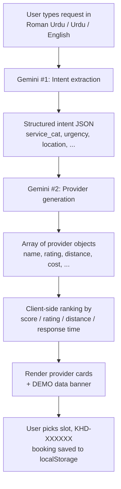

<div align="center">


# 🇵🇰 KHIDMAT

### خدمت

**A bilingual, AI-powered marketplace for finding verified local service providers across Pakistan — from plumbers to tutors, AC technicians to beauticians.**

[](https://fuwxt.github.io/Khidmat/)
[](LICENSE)
[](https://github.com/fuwxt/Khidmat/pulls)


[**🚀 Live Demo**](https://fuwxt.github.io/Khidmat/) · [**🐛 Report Bug**](https://github.com/fuwxt/Khidmat/issues) · [**✨ Request Feature**](https://github.com/fuwxt/Khidmat/issues)

---

</div>

> ## ⚠️ Prototype Notice
>
> **This is an early-stage prototype.** Provider names, phone numbers, ratings, and distances shown in search results are **AI-generated by Google Gemini** for demonstration purposes — they are **not real**. The WhatsApp / Call / Map buttons should not be used. There is currently no backend, no real authentication, and no persistent booking system on the server side. See the **[Roadmap](#-roadmap)** for what's needed to ship this for real.

<br />

## 🎯 What is Khidmat?

**Khidmat** (Urdu: *خدمت*, "service") is a mobile-first Progressive Web App that brings the experience of services marketplaces like **UrbanCompany** or **TaskRabbit** to Pakistan, with first-class support for **Roman Urdu, Urdu, and English** input — so a user can type *"Mujhe kal subah AC technician chahiye, gas bhi fill karni hai"* and the app understands.

Behind the scenes, **Google Gemini** parses the request, extracts service intent (category, urgency, time, location), and generates a ranked list of providers across the user's chosen Pakistani city.

<br />

## ✨ Features

<table>
<tr>
<td width="50%">

### 🌍 Bilingual & RTL-aware
Switch between **English** and **اردو** with one tap. Urdu mode flips to right-to-left layout with the **Noto Nastaliq Urdu** typeface throughout.

### 🤖 AI-powered intent extraction
Type naturally in **Roman Urdu, Urdu, or English** — Gemini parses what you need, where, when, and how urgently.

### 🏙️ Pakistan-wide city coverage
Searchable dropdown of **50+ Pakistani cities** across all provinces — Karachi, Lahore, Islamabad, Peshawar, Quetta, Gilgit, Muzaffarabad, and more.

### 💰 Fair-price estimator
Built-in price ranges for **8 service categories** in PKR — minimum, average, maximum, and emergency rates so users know what's fair before booking.

</td>
<td width="50%">

### 📱 Installable PWA
Static `manifest.webmanifest`, theme color, and icons — installable as a standalone app on Android and iOS home screens.

### 🌗 Dark + Light themes
Custom **Pakistan-flag-inspired green palette**, persisted across sessions via `localStorage`.

### 🎨 Premium mobile-first UI
Phone-styled layout (max 480px), spring animations, skeleton loaders, custom typography (**Plus Jakarta Sans** + **Playfair Display** + **Noto Nastaliq Urdu**).

### 📅 Full booking flow
Slot picker, special instructions, **bilingual confirmation screen** with `KHD-XXXXXX` reference codes, persistent bookings list.

</td>
</tr>
</table>

<br />

## 🚀 Live Demo

The app is deployed on GitHub Pages and ready to try:

### → **[https://fuwxt.github.io/Khidmat/](https://fuwxt.github.io/Khidmat/)** ←

You'll be asked for a free **[Google Gemini API key](https://aistudio.google.com)** on first launch. The key stays in your browser's `localStorage` and never leaves your device (see the [security note](#-configuration--security)).

<br />

## 📸 Screens

> *Drop screenshots into `docs/screenshots/` and reference them here. The app has these screens:*

| Onboarding | Home | Search Results | Booking |
|:---:|:---:|:---:|:---:|
| API key + trust chips | Natural-language input + categories | AI-ranked provider cards | Slot picker + confirmation |
| `s-setup` | `s-home` | `s-results` | `s-booking` → `s-confirmed` |

Other screens: `s-login`, `s-signup`, `s-otp` (mock auth flow), `s-price` (price estimator), `s-proc` (animated search progress), `s-bookings` (bookings list), `s-profile`.

<br />

## 🛠️ Tech Stack

<div align="center">

| Layer | Choice | Why |
|:---|:---|:---|
| **Frontend** | Vanilla HTML/CSS/JS | Zero build tooling; works offline; ships in seconds |
| **AI** | Google Gemini 2.0 Flash | Best-in-class multilingual (incl. Roman Urdu) at low cost |
| **Persistence** | `localStorage` | Theme, language, city, bookings, API key — all client-side |
| **Typography** | Plus Jakarta Sans · Playfair Display · Noto Nastaliq Urdu | Modern, editorial, Urdu-native |
| **Hosting** | GitHub Pages | Free, fast, zero-ops |
| **PWA** | Static manifest + theme color | Installable on Android & iOS |

</div>

<br />

## 🏗️ Project Structure

```
Khidmat/
├── 📄 index.html              ← Markup only — all 11 screens in one file
├── 🎨 styles.css              ← Design tokens, components, screen styles (619 lines)
├── ⚙️  app.js                  ← State, routing, Gemini calls, rendering (518 lines)
├── 📦 manifest.webmanifest    ← PWA manifest with 192/512 icons
├── 🚀 .github/workflows/
│   └── deploy-pages.yml       ← Auto-deploys to GitHub Pages on push to main
├── 📜 LICENSE                 ← MIT
├── 🙈 .gitignore
└── 📖 README.md               ← You are here
```

<br />

## 🏃 Getting Started

### Prerequisites

- A modern browser (Chrome, Edge, Firefox, Safari).
- A free **[Google Gemini API key](https://aistudio.google.com)** (free tier covers heavy daily use).
- *(Optional)* Python 3 or any static file server for local development.

### Run locally

The project is plain static files — **no build step**, **no `npm install`**, **no dependencies**:

```bash
# 1. Clone the repo
git clone https://github.com/fuwxt/Khidmat.git
cd Khidmat

# 2. Serve the directory with any static server
python3 -m http.server 8080

# 3. Open http://localhost:8080
```

Other static servers that work out of the box:

```bash
npx serve .          # Node
caddy file-server    # Go
php -S localhost:8080 # PHP
```

> 💡 Opening `index.html` directly via `file://` works for most things, but the manifest fetch and any future service-worker integration need an HTTP server. Use one.

<br />

## 🔐 Configuration & Security

On first launch, the app prompts for your **Gemini API key**. The key is:

- ✅ Stored only in your browser's `localStorage`
- ✅ Sent directly from your browser to `generativelanguage.googleapis.com` over HTTPS
- ❌ **Never** committed, transmitted to any other server, or logged

> ⚠️ **Important:** Because the key is in the browser, it is technically visible in network logs and to anyone with access to the device. This is acceptable for a personal prototype but **not** for a production app — a backend proxy is the next architectural step (see [Roadmap](#-roadmap)).

<br />

## 🧠 How It Works



1. **Intent extraction.** The user's free-text request and selected city are sent to Gemini, which returns a structured JSON intent (service category, urgency, time preference, requirements).
2. **Provider generation.** A second Gemini call asks for a JSON array of plausible providers in that city for that service.
3. **Ranking & rendering.** The client sorts by an LLM-supplied `score`, applies optional filters (top / nearby / fast), and renders provider cards with quick-action buttons (Book, WhatsApp, Call, Map).
4. **Booking.** The user picks a time slot; the booking gets a `KHD-XXXXXX` reference and is saved to `localStorage` and surfaced in the *Bookings* screen.

<br />

## 🗺️ Roadmap

### 🔴 Critical — blocks any real launch

- [ ] **Real provider database** with consenting, verified Pakistani service providers (replaces AI-generated names/numbers)
- [ ] **Backend proxy for Gemini** so the API key isn't exposed in the browser
- [ ] **Real authentication** (Firebase / Supabase / Clerk with WhatsApp OTP) — current login/signup/OTP are UI-only
- [ ] **Server-persisted bookings** that providers actually receive
- [ ] **Cancel & reschedule** to honor the "free cancellation" copy

### 🟡 High value

- [ ] Send uploaded photos to **Gemini Vision** for problem diagnosis (currently the file is dropped on the floor)
- [ ] **Real geolocation** via `navigator.geolocation` instead of LLM-fabricated distances
- [ ] **Date picker** for bookings (currently hardcoded to "tomorrow")
- [ ] **Reviews & ratings** flow after a job is completed
- [ ] **Forgot password / password reset** flow
- [ ] **Push notifications** and reminders (the timeline UI already advertises them)

### 🔵 Polish & accessibility

- [ ] Replace `<div onclick>` with `<button>` for keyboard / screen-reader access
- [ ] `aria-live` announcements on the search-progress status
- [ ] Locale-aware `toLocaleDateString` (Urdu mode currently shows English dates)
- [ ] Tablet/desktop-friendly responsive layout (currently always 480px wide)

### 🟢 Tooling

- [ ] **Service worker** for offline support
- [ ] **Linter + formatter** (ESLint, Prettier)
- [ ] **Unit tests** for the intent-extraction prompt and parser
- [ ] **CodeQL** or similar security scanning on PRs

<br />

## 🤝 Contributing

Contributions are welcome and encouraged. The roadmap above is a great place to start — each item is intentionally scoped to be a single small PR.

```bash
# 1. Fork & clone
git clone https://github.com/<your-username>/Khidmat.git
cd Khidmat

# 2. Create a focused branch
git checkout -b feat/your-feature

# 3. Hack, commit, push
git commit -m "feat: short description"
git push origin feat/your-feature

# 4. Open a PR against main
```

**PR guidelines:**
- Keep diffs small and focused on one concern.
- Prefer `<button>` over `<div onclick>` in any new markup.
- Preserve bilingual parity — if you add user-facing text, add **both** English and Urdu variants using the existing `e-text` / `u-text` and `e-i` / `u-i` classes.
- Test in **dark and light** themes.
- Test in **Roman Urdu / Urdu / English** input modes.

<br />

## 📜 License

This project is licensed under the **MIT License** — see [LICENSE](LICENSE) for details.

<br />

## 👨‍💻 Author

<div align="center">

**Muhammad Azhar Shahbaz**

Made with ❤️ in Pakistan 🇵🇰

[](https://github.com/fuwxt)

</div>

<br />

## 🙏 Acknowledgements

- [**Google Gemini**](https://aistudio.google.com) — multilingual intent extraction and content generation
- [**Plus Jakarta Sans**](https://fonts.google.com/specimen/Plus+Jakarta+Sans) and [**Playfair Display**](https://fonts.google.com/specimen/Playfair+Display) — Latin typography
- [**Noto Nastaliq Urdu**](https://fonts.google.com/specimen/Noto+Nastaliq+Urdu) — Urdu typography
- [**peaceiris/actions-gh-pages**](https://github.com/peaceiris/actions-gh-pages) — reliable GitHub Pages deployment
- The **people of Pakistan** — the reason this project exists

<br />

<div align="center">

### ⭐ If you find this project useful, consider starring the repo!

[](https://github.com/fuwxt/Khidmat/stargazers)

**خدمت — پاکستان کی بھروسہ مند خدمات**

</div>
